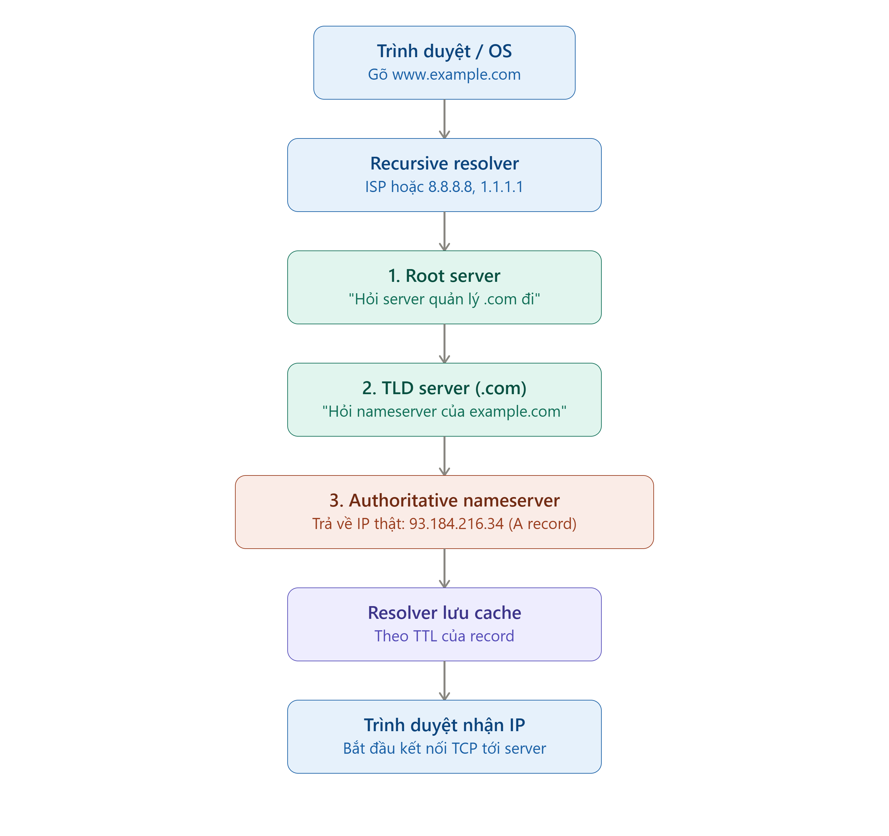

# DNS là gì?
* DNS (Domain Name System) là hệ thống dịch tên miền dễ nhớ thành địa chỉ IP mà máy tính thực sự dùng để định tuyến.
* Nó giống một cuốn danh bạ điện thoại phân tán khổng lồ, không nằm ở một nơi duy nhất mà trải trên hàng triệu server khắp thế giới, tổ chức theo cấu trúc phân cấp (hierarchical).

# Cấu trúc phân cấp DNS
* **Root (.)**: Cấp cao nhất, chỉ có 13 cụm địa chỉ IP root server (a.root-servers.net đến m.root-servers.net), nhưng thực tế mỗi cụm này có hàng trăm server vật lý trải khắp thế giới nhờ kỹ thuật Anycast (nhiều server dùng chung 1 IP, traffic được định tuyến tới server gần nhất).
* **TLD (Top-Level Domain)**: .com, .org, .vn... Được quản lý bởi các tổ chức registry (VD: Verisign quản lý .com).
* **Authoritative nameserver**: Server "biết chính xác" IP của domain cụ thể, do công ty sở hữu domain đó cấu hình (VD: Cloudflare, Route53, hoặc nameserver riêng của công ty).
* **Recursive resolver** là server đóng vai trò trung gian tra cứu hộ giữa thiết bị của bạn và toàn bộ hệ thống DNS phân cấp (root → TLD → authoritative). Nó nhận một truy vấn duy nhất từ client ("IP của example.com là gì?") và tự mình thực hiện toàn bộ chuỗi truy vấn đệ quy thay cho bạn, rồi trả về một kết quả cuối cùng.

* Recursive resolver có 3 nhóm chính: 
1. ISP (mặc định) — Viettel, VNPT, FPT... tự vận hành resolver riêng, và router nhà bạn tự động dùng nó qua DHCP khi bạn kết nối mạng.
2. Public DNS provider — Google (8.8.8.8), Cloudflare (1.1.1.1), Quad9 (9.9.9.9) — như đã nói ở câu trước, đây là các resolver mở, bạn có thể tự cấu hình để dùng thay ISP.
3. Doanh nghiệp / hạ tầng nội bộ — nhiều công ty (kể cả ngân hàng như pgbank) vận hành resolver nội bộ riêng (VD: BIND, Unbound, hoặc Windows DNS Server) để: cache truy vấn cho nhân viên (nhanh hơn), áp policy chặn domain độc hại, hoặc phân giải tên miền nội bộ (internal-api.pgbank.local) mà DNS công cộng không biết tới.

* Vì sao người ta đổi sang dùng public resolver? 
1. **Tốc độ**: Các resolver này thường có hạ tầng Anycast khổng lồ, cache rộng, độ trễ tra cứu thấp hơn resolver ISP (nhất là ISP nhỏ, hạ tầng yếu).
2. **Riêng tư**: Một số ISP log lại toàn bộ lịch sử truy vấn DNS của bạn (biết bạn ghé domain nào) để bán dữ liệu quảng cáo hoặc theo yêu cầu pháp lý. Cloudflare 1.1.1.1 cam kết không log/bán dữ liệu truy vấn.
3. **Bảo mật**: Một số public resolver (như Quad9, Cloudflare) tích hợp chặn domain độc hại (malware, phishing) ngay ở tầng resolver.
4. **Vượt chặn**: Một số ISP chặn DNS tới domain nhất định (theo yêu cầu quản lý nhà nước) — đổi resolver có thể (nhưng không luôn) bỏ qua kiểu chặn DNS-level này.

# Quá trình phân giải (resolution)
* DNS Caching: Các bản ghi DNS có thể được Cache ở Browser, OS Cache, ISP để tăng performance, giảm độ trễ và có TTL (Time To Live). Đây chính là lý do khi bạn đổi IP server, phải chờ "DNS propagation" — vì cache cũ ở khắp nơi trên thế giới chưa hết hạn.
